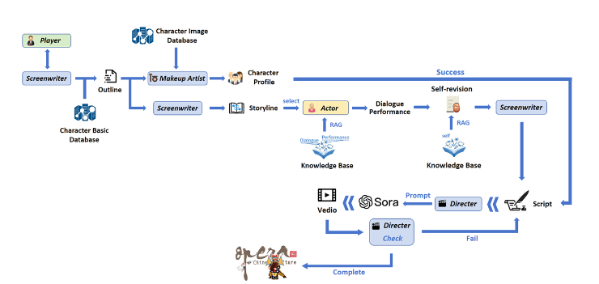

# Beyond Dialogue: Customized Multi-Agent Role-Playing for Peking Opera Performance

> 超越对话：面向京剧表演的定制化多智能体角色扮演系统

## 项目概述

本项目构建了一套面向京剧表演的**多智能体角色扮演剧本生成系统**，通过大语言模型（LLM）与检索增强生成（RAG）技术，实现对特定京剧角色（如诸葛亮、孙悟空、赵匡胤等）的深度定制化剧本自动创作。系统不仅能够生成符合京剧规范（西皮/二黄唱腔、念白风格、舞台动作）的剧本对话，还能根据角色历史表演数据生成个性化的唱腔设计、服装配置与场景布局，并通过下游视频生成子系统实现最终的数字京剧表演内容。

## 系统流程图



系统由三个核心阶段组成：

1. **数据提取阶段**：从历史京剧剧本（PDF/TXT）中提取结构化角色数据，经 LLM 语义增强后构建角色知识库
2. **RAG 检索增强阶段**：基于 FAISS 向量索引，为剧本生成提供精准的历史表演片段参考
3. **多智能体剧本生成阶段**：由导演、编剧、演员、服装设计等多个专业智能体协作，生成完整的定制化京剧剧本

---

## 项目结构

```
.
├── 流程图.png                    # 系统架构流程图
├── main.py                       # 🚀 主入口：剧本生成系统启动脚本
├── src/                          # 核心源代码
│   ├── config.py                 # 全局配置（API密钥、模型参数等）
│   ├── data_extraction/          # 数据提取模块
│   │   ├── extractor.py          # PDF/TXT剧本结构化提取
│   │   ├── llm_client.py         # LLM API客户端
│   │   ├── data_models.py        # 数据结构定义
│   │   ├── utils.py              # 工具函数
│   │   └── main.py               # 数据提取入口
│   ├── rag_system/               # RAG检索增强模块
│   │   ├── vector_processor.py   # 文本向量化处理
│   │   ├── vector_store.py       # FAISS向量存储管理
│   │   ├── semantic_retriever.py # 语义相似度检索
│   │   ├── scene_enhancer.py     # 场景增强器
│   │   └── main.py               # RAG系统入口
│   └── script_generation/        # 多智能体剧本生成模块
│       ├── agent_base.py         # 智能体基类
│       ├── director_agent.py     # 导演智能体（统筹协调）
│       ├── screenwriter_agent.py # 编剧智能体（剧情大纲）
│       ├── actor_agent.py        # 演员智能体（角色对话）
│       ├── costume_designer_agent.py # 服装设计智能体
│       ├── scene_setting_agent.py    # 场景设定智能体
│       ├── dialogue_manager.py   # 多智能体对话管理器
│       ├── context_builder.py    # 上下文构建器
│       ├── script_formatter.py   # 剧本格式化输出
│       └── main.py               # 剧本生成入口
├── scripts/                      # 工具脚本集合
│   ├── data_collection/          # 数据采集脚本
│   │   ├── search_bilibili.py
│   │   └── search_bilibili_batch.py
│   ├── data_processing/          # 数据处理脚本
│   │   ├── extract.py
│   │   ├── process_with_model.py
│   │   └── process_with_model_batch.py
│   ├── demo/                     # 功能演示脚本
│   │   └── demo_scene_setting.py
│   ├── evaluation/               # 评估与对比脚本
│   │   ├── compare_scripts.py
│   │   └── regenerate_script.py
│   └── tests/                    # 测试脚本
│       ├── simple_test.py
│       ├── test_import.py
│       ├── test_cleaning.py
│       ├── test_scene_setting.py
│       └── test_scene_fix.py
├── pdfdata/                      # 原始PDF剧本（按角色分类）
│   ├── 孙悟空/
│   ├── 诸葛亮/
│   └── 赵匡胤/
├── txtdata/                      # 原始TXT剧本（按角色分类）
├── enhanced_script/              # LLM增强后的结构化剧本
│   ├── 孙悟空/
│   ├── 诸葛亮/
│   └── 赵匡胤/
├── character_data/               # 角色知识库JSON数据
│   ├── 孙悟空/data.json
│   └── 诸葛亮/data.json
├── character/                    # 角色档案（Profile）
│   ├── 孙悟空/profile.json
│   └── 诸葛亮/profile.json
├── vector_index/                 # FAISS向量索引（当前版本）
│   ├── faiss.index
│   └── documents.json
├── generated_scripts/            # 系统生成的剧本输出
│   ├── 煮酒论英雄_剧本.txt
│   ├── 煮酒论英雄_大纲.json
│   ├── 煮酒论英雄_场景设定.json
│   ├── 煮酒论英雄_装扮设计.json
│   └── 煮酒论英雄_评估报告.json
├── example/                      # 示例剧本参考
├── doc/                          # 开发文档
│   ├── RAG改进总结.md
│   ├── 剧本格式改进说明.md
│   ├── 场景设定功能说明.md
│   └── ...
├── vedio_generation/             # 🎬 视频生成子项目（下游任务）
│   ├── main.py
│   ├── run_pipeline.py
│   ├── src/
│   ├── scripts/
│   ├── README.md
│   └── requirements.txt
└── src/data_extraction/README.md
```

---

## 核心模块详解

### 1. 数据提取模块 (`src/data_extraction/`)

从原始京剧剧本（PDF/TXT格式）中提取结构化数据，通过大语言模型进行语义增强，生成包含以下信息的角色知识库：

- **唱腔数据**：西皮、二黄等唱腔类型的完整唱词
- **念白数据**：韵白、散白的台词风格
- **动作数据**：水袖、圆场、亮相等身段动作描述
- **情节数据**：剧目故事背景与角色关系

### 2. RAG 检索增强模块 (`src/rag_system/`)

基于 FAISS 向量数据库构建语义检索系统：

- **向量化**：将增强剧本切片并编码为语义向量
- **检索**：根据当前剧情需求，检索历史相似表演片段
- **增强**：将检索结果注入剧本生成提示词，提升角色一致性

### 3. 多智能体剧本生成模块 (`src/script_generation/`)

采用专业化多智能体协作架构：

| 智能体 | 职责 |
|--------|------|
| `DirectorAgent`（导演） | 统筹全局，协调各智能体，控制剧情走向 |
| `ScreenwriterAgent`（编剧） | 生成剧情大纲，规划幕次结构 |
| `ActorAgent`（演员） | 基于角色档案生成个性化对话与唱腔 |
| `CostumeDesignerAgent`（服装设计） | 设计符合角色身份的服装、头饰、道具 |
| `SceneSettingAgent`（场景设定） | 规划舞台布景、灯光、音效配置 |

---

## 数据流向

```
[数据采集]
哔哩哔哩/戏曲资源库
        ↓
pdfdata/ & txtdata/（原始剧本）
        ↓
[数据处理]
scripts/data_processing/extract.py
        ↓
enhanced_script/（结构化剧本）
        ↓
scripts/data_processing/process_with_model_batch.py
        ↓
character_data/（角色JSON知识库）
        ↓
[RAG索引构建]
src/rag_system/
        ↓
vector_index/（FAISS向量索引）
        ↓
[多智能体剧本生成]
python main.py
        ↓
generated_scripts/（完整剧本 + 场景设定 + 装扮设计 + 评估报告）
        ↓
[下游：视频生成]
vedio_generation/
        ↓
京剧数字表演视频
```

---

## 快速开始

### 环境要求

- Python 3.8+
- 依赖包见 `vedio_generation/requirements.txt`（视频生成部分）
- 大语言模型 API（OpenAI / DeepSeek / 其他兼容接口）
- FAISS（向量检索库）

### 安装依赖

```bash
pip install openai faiss-cpu numpy requests beautifulsoup4
```

### 配置 API

编辑 `src/config.py`，填入 LLM API 密钥和接口地址：

```python
API_KEY = "your_api_key_here"
API_BASE_URL = "https://api.openai.com/v1"  # 或其他兼容接口
MODEL_NAME = "gpt-4o"
```

### 运行剧本生成

```bash
# 直接运行主程序（交互式输入剧目名称和角色信息）
python main.py
```

### 完整数据管线（从零开始）

```bash
# Step 1: 数据处理（将原始剧本提取为结构化数据）
python scripts/data_processing/extract.py
python scripts/data_processing/process_with_model_batch.py

# Step 2: 构建RAG向量索引
python src/rag_system/main.py

# Step 3: 生成剧本
python main.py

# Step 4: （可选）评估与对比
python scripts/evaluation/compare_scripts.py
```

---

## 示例输出

系统对"煮酒论英雄"剧目的生成结果（存储于 `generated_scripts/`）：

- `煮酒论英雄_大纲.json` — 剧情大纲与幕次规划
- `煮酒论英雄_场景设定.json` — 舞台场景、灯光、音效配置
- `煮酒论英雄_装扮设计.json` — 角色服装、头饰、道具设计
- `煮酒论英雄_剧本.txt` — 完整剧本（含唱词、念白、身段动作）
- `煮酒论英雄_评估报告.json` — 生成质量多维评估报告

参考完整剧本示例：`example/煮酒论英雄_完整剧本(1).txt`

---

## 已支持角色

| 角色 | 行当 | 代表剧目数量 |
|------|------|-------------|
| 诸葛亮 | 老生 | 21 部 |
| 孙悟空 | 武生/猴戏 | 13 部 |
| 赵匡胤 | 老生 | 22 部 |

---

## 子项目：视频生成系统

`vedio_generation/` 目录为独立的下游视频生成子项目，接收本系统生成的剧本，自动化合成京剧表演视频。

详见 [`vedio_generation/README.md`](vedio_generation/README.md)

---

## 开发文档

详细的模块设计与改进记录见 `doc/` 目录：

- [`RAG改进总结.md`](doc/RAG改进总结.md) — 检索增强系统优化过程
- [`剧本格式改进说明.md`](doc/剧本格式改进说明.md) — 剧本格式规范与改进
- [`场景设定功能说明.md`](doc/场景设定功能说明.md) — 场景设定智能体设计
- [`目标1完成总结.md`](doc/目标1完成总结.md) — 数据提取阶段完成记录
- [`目标2完成总结.md`](doc/目标2完成总结.md) — RAG系统完成记录
- [`目标3完成总结.md`](doc/目标3完成总结.md) — 多智能体系统完成记录

---

## 技术架构

- **大语言模型**：OpenAI GPT-4 / DeepSeek（可配置）
- **向量检索**：FAISS（Facebook AI Similarity Search）
- **文本处理**：自定义京剧文本清洗与结构化管线
- **多智能体框架**：自研基于提示词工程的多智能体协作框架
- **数据格式**：JSON（角色档案/场景配置）+ TXT（剧本正文）